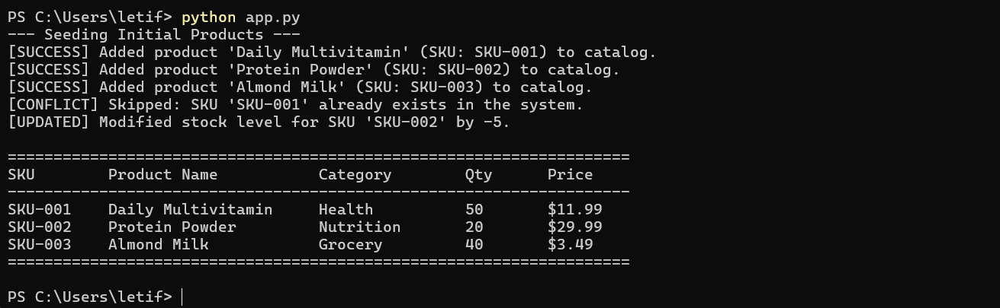

# Retail Inventory Tracker

A lightweight Python and SQLite management tool designed to track retail products, manage SKU inventory levels, and handle basic transactional updates safely.



## Key Technical Features
* **Relational Database Design:** Employs SQLite with schema constraints (`PRIMARY KEY`, `UNIQUE`, `NOT NULL`) to maintain data integrity.
* **Security Standards:** Utilizes parameterized SQL queries (`?` placeholders) across all read/write methods to protect against SQL injection vulnerabilities.
* **Defensive Exception Handling:** Catches database integrity conflicts (e.g., duplicate SKUs) cleanly without application termination.

## Technologies Used
* **Language:** Python 3.x
* **Database:** SQLite3 (built-in)

## How to Run Locally
1. Clone the repository:
   ```bash
   git clone [https://github.com/Leifernayahmatiafa/retail-inventory-sqlite.git](https://github.com/Leifernayahmatiafa/retail-inventory-sqlite.git)
   cd retail-inventory-sqlite
